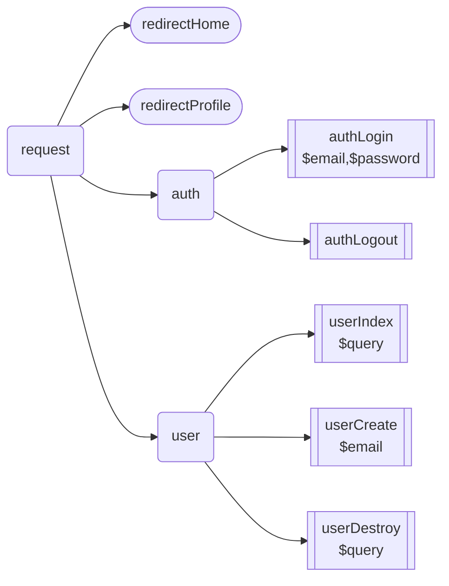

```mermaid
flowchart LR
    request(request) --> Home([redirectHome])
        request --> Profile([redirectProfile])
    request --> auth(auth)
        auth --> Login[[authLogin
        $email,$password]]
        auth --> Logout[[authLogout]]
    request --> user(user)
        user --> User[[userIndex
        $query]]
        user --> UserCreate[[userCreate
        $email]]
        user --> UserDestroy[[userDestroy
        $query]]
```
